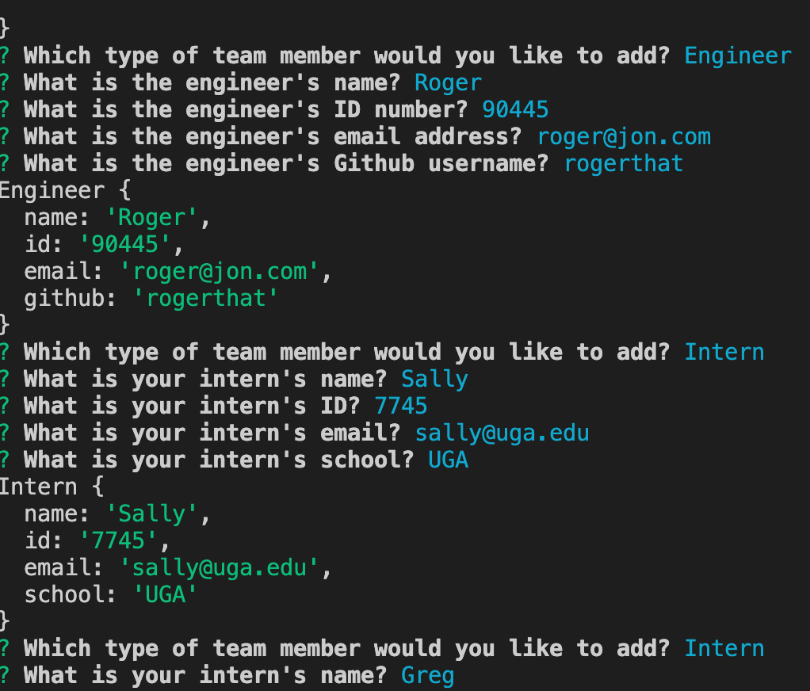
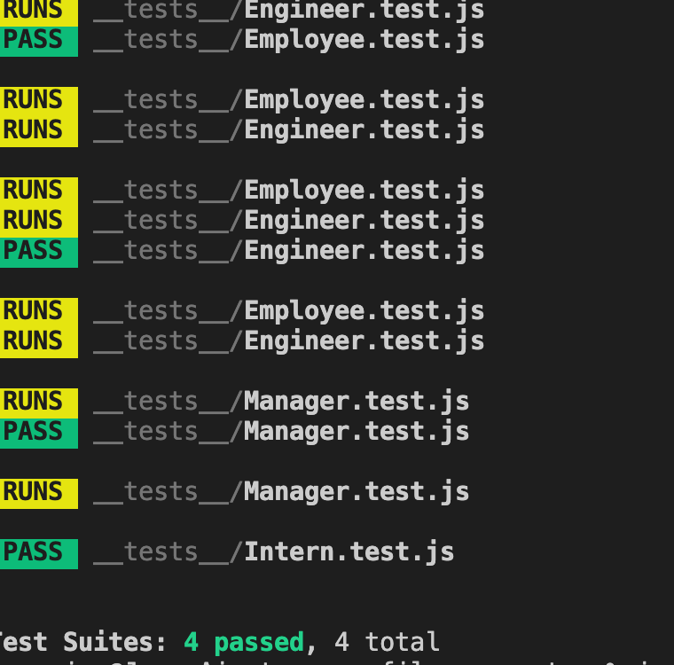

# Team Profile Generator

## Purpose
User is asked a series of questions from a prompt about specific team members to include manager, engineer, and intern.  Each team member is assigned a name, id, email. Additionally, the manager is assigned an office number, the engineer is assigned a Github name, and the a school is listed for an intern. Once all team members are submitted, a html page is generated that lists all team members.  Click on email composes a new email for specific team member. A link to click on the Github username takes user to the Github page.  

## Built With
* JavaScript
* CSS
* HTML
* Bootstrap
* Node
* Jest

## Installation
install inquirer and jest

## Contribution
Made by Jon Prine

## Screenshots of Finished Page

